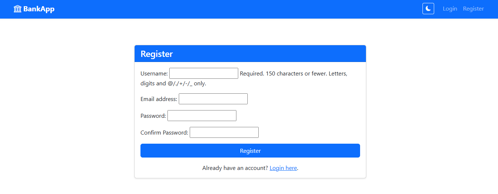
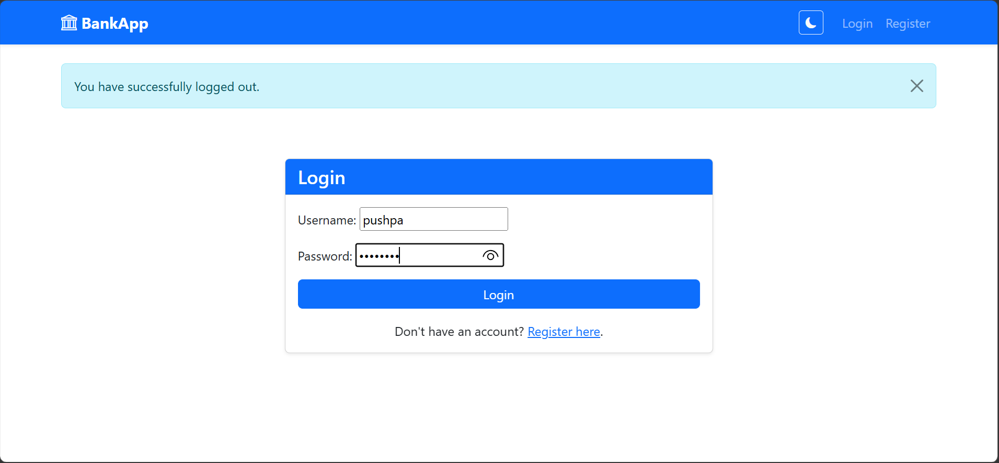
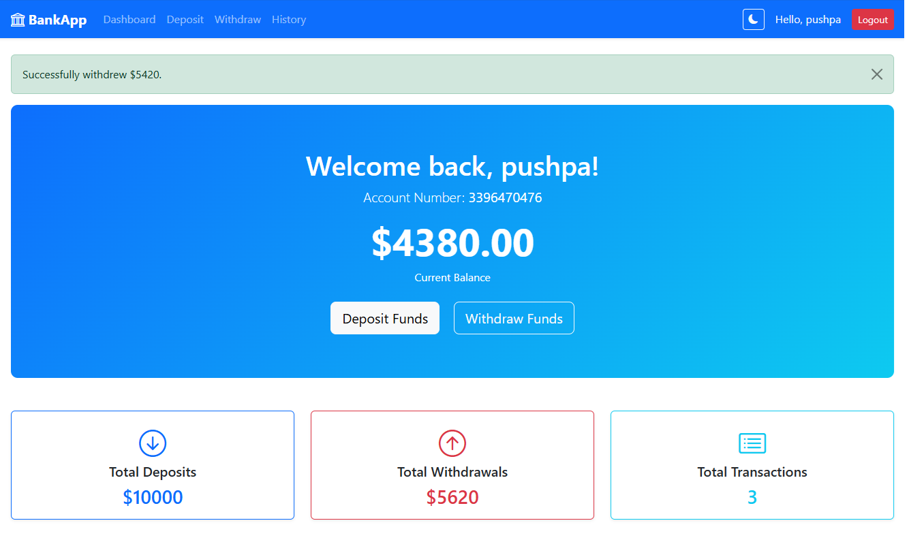
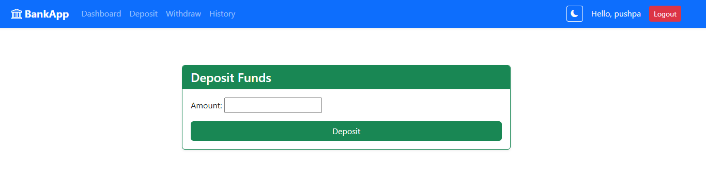
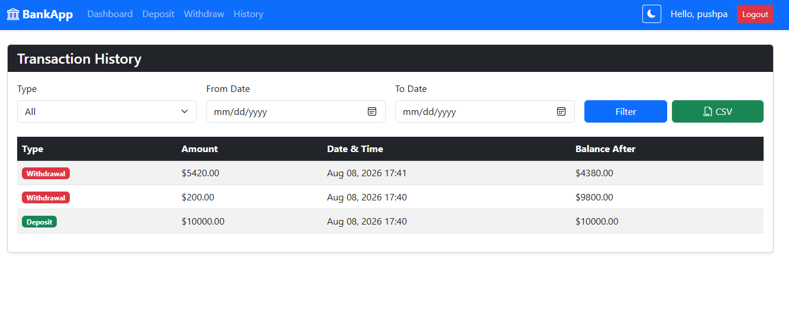

# Bank Account Transaction Management System

A secure, fully-featured Bank Account Transaction Management System built with Django. 

## Features
- **User Authentication**: Secure registration, login, and logout. Data is isolated per user.
- **Account Management**: Seamlessly create a bank account with auto-generated 10-digit account numbers.
- **Transactions**: Deposit and withdraw funds with built-in overdraft protection.
- **Transaction History**: View, search (by type), and filter (by date range) past transactions. Export to CSV functionality included!
- **Dashboard**: Aggregated metrics for total deposits, total withdrawals, and total transactions.
- **Beautiful UI**: Fully responsive frontend built with Bootstrap 5.3, including a Dark Mode toggle!

## Setup Instructions
1. Ensure you have Python installed.
2. Navigate to the project directory.
3. Apply migrations: `python manage.py migrate`
4. Run the development server: `python manage.py runserver`
5. Open your browser and go to `http://127.0.0.1:8000/register/`.

## Screenshots

### 1. Registration Page

### 2. Login Page

### 3. Dashboard

### 4. Deposit/Withdraw Funds

### 5. Transaction History

