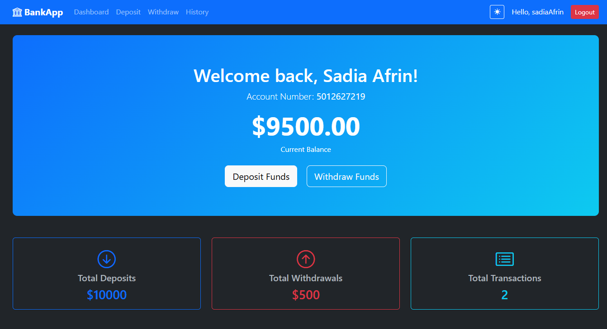
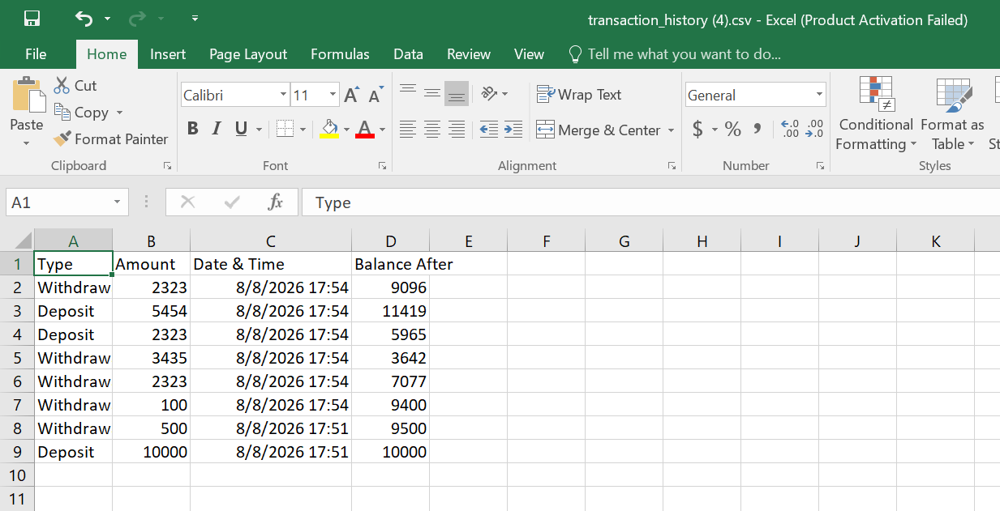

# Bank Management System

This is a Bank Account Transaction Management System assignment. It allows users to create accounts, deposit and withdraw money, and view their transaction history.

## Features
- User registration and login
- Bank account creation with auto-generated account numbers
- Deposit and withdraw functionality with overdraft protection
- Transaction history with date and type filters
- Dashboard showing current balance and totals
- Responsive UI with dark mode support

## Setup
1. Install requirements
2. Run migrations: `python manage.py migrate`
3. Start the server: `python manage.py runserver`
4. Go to `http://127.0.0.1:8000/register/` in your browser.

## Screenshots

### 1. Registration Page

### 2. Login Page

### 3. Dashboard

### 4. Deposit/Withdraw Funds

### 5. Transaction History

### 6. Dark Mode Dashboard

### 6. CSV Export

